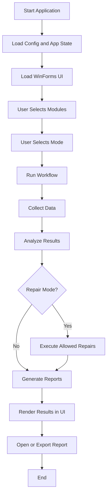
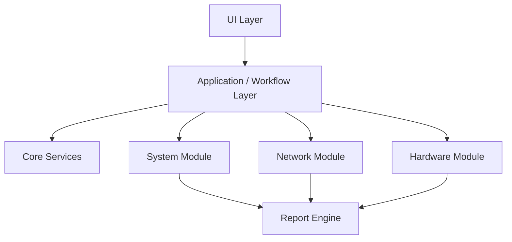
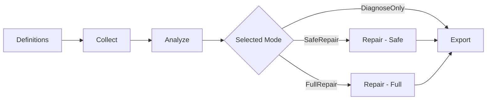
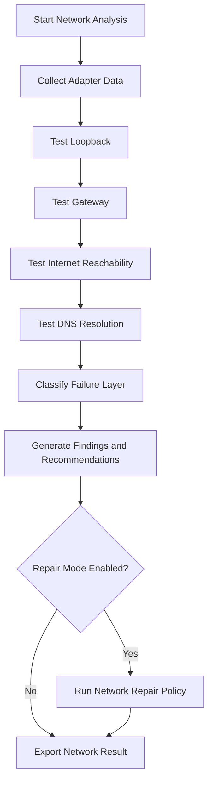
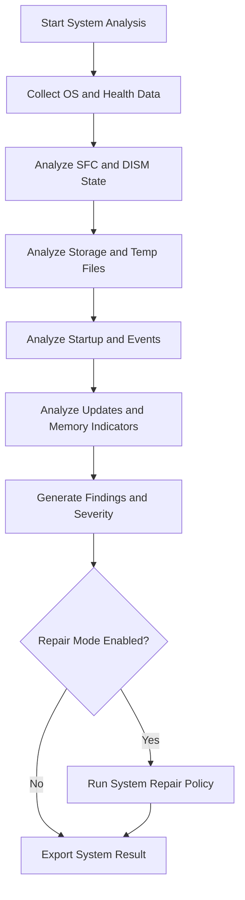
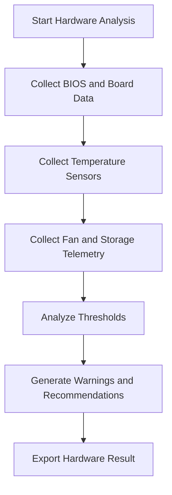
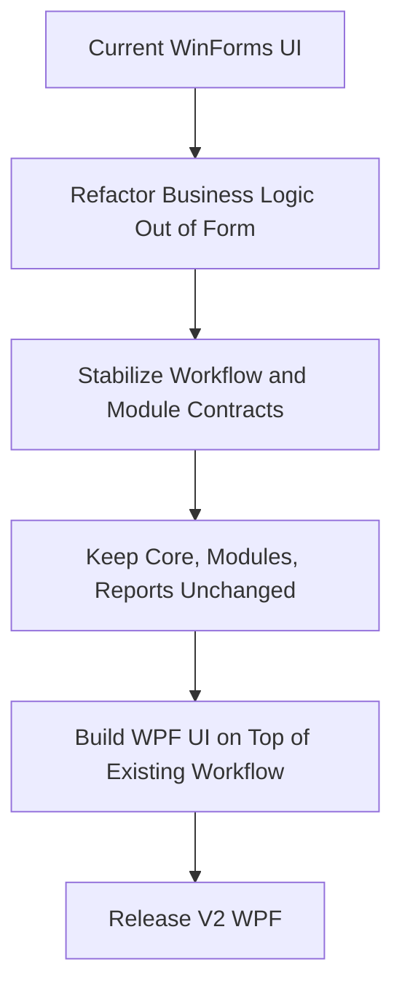

# FixPC Toolkit Flowcharts

## 1. High-level product flow

## 2. Internal architecture flow

## 3. Standard module lifecycle

## 4. Network diagnostic flow

## 5. System diagnostic flow

## 6. Hardware diagnostic flow

## 7. WinForms to WPF migration strategy

